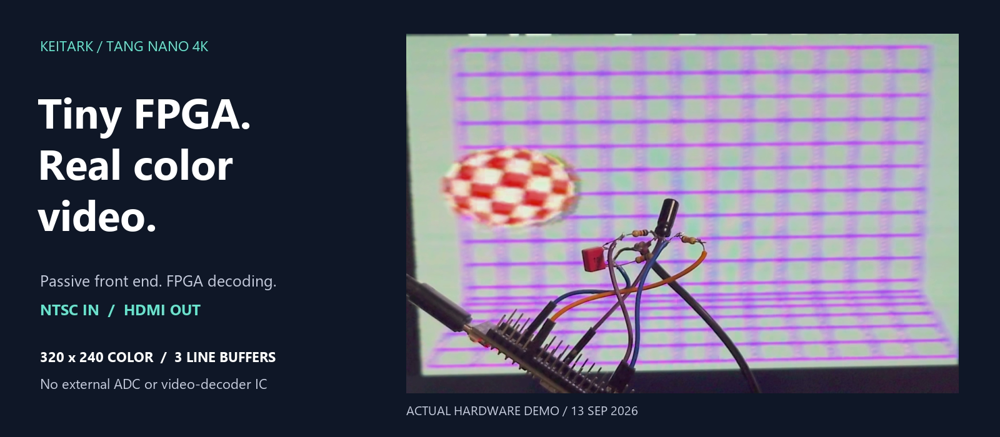

# Tang Nano 4K composite video input



*Banner: cropped frame from the author's September 13 hardware-demo video,
tone-mapped from HDR to SDR for display. Titles are presentation overlays;
the circuit and decoded picture are real footage.*

## Current verified milestone — September 13, 2026

Real-time **320x240 RGB565 color NTSC input to 640x480 HDMI** on the
Tang Nano 4K, using an LVDS comparator, GPIO/RC feedback and **three line
buffers**, with no full-frame buffer and no external ADC or video-decoder IC.
The front end includes termination, AC coupling and bias components in
addition to the feedback resistor/capacitor; it is not three components total.

The comparator runs at 108 MHz. Digital reconstruction produces samples at
13.5 MSamples/s (8:1 downsampling). The 8-bit reconstructed sample format is
**not a measured 8-bit effective ADC resolution**.

The recorded Boing Ball captures show a moving red/white ball and purple grid.
Two recorded tests total 1,481 frames with no capture read failures or reported
line-buffer underflows. Small edge/color artifacts remain: this is a lab
prototype, not a calibrated or lossless video digitizer.

**Native FPGA USB-UVC output is not implemented by this milestone.** The host
recordings used an external HDMI capture device. Earlier USB-related modules
are experimental and must not be mistaken for a working USB camera product.

## Working circuit: AC-coupled CVBS input

The hand-wired NEO FAMI prototype uses **four resistors and two capacitors**
outside the Tang Nano 4K. The owner confirmed the fitted feedback capacitor
as **33 pF** on September 14, 2026. This documents the reported bench assembly;
it is not a vendor-qualified ADC circuit or a production safety approval.

```text
                                               Tang Nano 4K
                              board 3.3 V
                                  |
                              R2 33 kohm
                                  |
Yellow RCA center --+-- (+ C1 -) --+---------- FPGA pin 39 / LVDS+
                    |    4.7 uF   |
                 R1 75 ohm    R3 10 kohm
                    |             |
Yellow RCA shell ---+-------------+---------- board GND

FPGA pin 16 / 1.8 V GPIO -- R4 2 kohm --+---- FPGA pin 40 / LVDS-
                                       |
                                    C2 33 pF
                                       |
                                    board GND
```

| Part | Value | Connection / role |
|---|---|---|
| R1 | 75 ohm | RCA center to ground, **before** C1; video termination |
| C1 | 4.7 uF electrolytic | Series video coupling: **positive to RCA**, negative to the biased pin-39 node, for this source |
| R2 | 33 kohm | Board 3.3 V to pin-39 node; upper bias resistor |
| R3 | 10 kohm | Pin-39 node to ground; lower bias resistor |
| R4 | 2 kohm | Pin 16 to pin-40 node; one-bit feedback resistor |
| C2 | **33 pF** | Pin-40 node to ground; feedback capacitor, non-polarized |

The unloaded bias is approximately `3.3 x 10 / (33 + 10) = 0.767 V`.
Pin 40 is the **feedback node**, not ground and not the RCA shield. Do not
short pins 39 and 40 together. All ground symbols are the same electrical net.

| Signal | FPGA package pin | Board header reference |
|---|---|---|
| Video input, LVDS+ | **39** | P7 pin 6 |
| Feedback node, LVDS- | **40** | P7 pin 7 |
| Feedback output, LVCMOS18 | **16** | P6 pin 13 |
| Common ground | GND | P6 pin 20 |

Numbers 39/40/16 identify **FPGA package pins**, not positions counted along a
header. Check the board revision, silkscreen and continuity before connecting.
Disconnect the camera module/ribbon, which shares these nets. Use the board's
labeled **3.3 V** supply for R2, not 5 V or the feedback GPIO.

**Polarity and safety:** C1's polarity above follows the NEO FAMI's recorded
higher source-side DC voltage. It is not universal for other composite sources;
check voltage across a polarized capacitor, including startup/shutdown. A
multimeter average cannot establish peak input voltage or safe common-mode
range. Never connect an active source to an unpowered FPGA, and power off
before changing wiring. Keep R4/C2 and their ground return very short. Do not
enable internal 100-ohm termination across the LVDS inputs.

See [the complete circuit notes](hardware/cvbs_ac_coupled_afe.md) for exact
node connections, operating principle, voltage-domain checks and limitations.

### Related work: Lattice Simple Sigma-Delta ADC

[Lattice Semiconductor, *Simple Sigma-Delta ADC*, FPGA-RD-02047-1.6
(December 2019)](https://www.latticesemi.com/view_document?document_id=35762)
documents an FPGA/LVDS-comparator ADC with one-bit feedback and an external
RC network. See **Figure 5.1, DIRECT Analog Input Topology (page 6)** and
Sections 5.2–5.4 for the comparator, sampling element and digital filtering.

Our front end uses the same basic comparator/GPIO/RC-feedback topology,
with additional CVBS termination, AC coupling and bias. This project's
video-specific implementation runs the comparator at 108 MHz, reconstructs
samples at 13.5 MSamples/s, decodes NTSC color, and outputs HDMI through
three line buffers. These are project implementation results, not a claim
of a new ADC topology or measured accuracy superiority over Lattice's design.
See the [hardware verification evidence](evidence/color-three-line-verified-20260913.md).

### Build the verified color configuration

Use the required Gowin toolchain (recorded baseline: Gowin 1.9.8) and the
`GW1NSR-LV4CQN48PC6/I5` target. From the repository root in PowerShell:

```powershell
$env:NTSC_RUNTIME_PROBE = 'line320_cic2'
$env:NTSC_BUILD_ROOT = Join-Path (Get-Location) 'build/ntsc_three_line320_cic2_rebuild'
& 'C:\Gowin\Gowin_V1.9.8\IDE\bin\gw_sh.exe' tools/build_ntsc_hdmi_c6.tcl
```

Do not set `NTSC_RAW_SNAPSHOT` at the same time. The build produces
`impl/pnr/project.fs` under the selected build directory. Programming must
follow every gate in [AGENTS.md](AGENTS.md): **Sipeed-distributed Programmer,
JTAG at or below 2.5 MHz, volatile SRAM only** unless flash is explicitly
authorized. A fresh build is not automatically hardware-verified.

### Evidence and source layout

- [Verified milestone and recorded artifact hash](evidence/color-three-line-verified-20260913.md)
- [Pre-downsampling filter change and measured capture comparison](evidence/color-noise-improvement-20260913.md)
- `rtl/`: sampling, NTSC decoder, line storage, HDMI and experimental USB HDL.
- `constraints/`: pin and timing constraints; `tb/`: simulation testbenches.
- `tools/`: build scripts, capture analysis and test helpers.
- [Working AC-coupled front end](hardware/cvbs_ac_coupled_afe.md): circuit,
  parts, polarity and pin mapping.
- [Front-end history](hardware/cvbs_delta_modulator_afe.md): superseded
  direct-coupled experiment, not the current wiring instructions.

This private repository contains source and selected text evidence. Vendor
tool packages, generated bitstreams, recordings, machine/driver diagnostics
and personal working files remain local. Paths to those files in historical
records are provenance references, not files included in this repository.
No new project-wide license is granted by this initial upload; retain any
existing third-party notices and review licensing before public distribution.

<details>
<summary>Historical bring-up notes (not the current recommended build or wiring)</summary>

The following original notes are preserved for context. In particular, the
two-buffer description and direct-coupled three-component wiring below refer
to earlier experiments, not the verified configuration above.

Programming and device-driver work in this repository must follow
[AGENTS.md](AGENTS.md). The supported route is the Programmer package
distributed by Sipeed; openFPGALoader/WinUSB is not an automatic fallback.

The verified board baseline currently uses the conservative
`GW1NSR-LV4CQN48PC6/I5` build target. The earlier C7/I6 USB high-speed clock
probe remains an upgrade-path experiment; it is not a valid current-board HS
claim.

## NTSC color-decoder HDMI candidate

A complete first-pass NTSC-to-HDMI path is now available for bench tuning. It
uses the same three-component LVDS delta-modulator front end, reconstructs the
composite level at 13.5 MHz, separates sync, estimates black level, locks a
quadrature NCO to color burst, produces RGB565, and outputs 640x480 HDMI.

The C6/I5 device cannot combine the selected front-end pins with the official
camera example's HyperRAM I/O placement. The implemented design therefore uses
two internal 640-pixel line buffers and bob deinterlacing: every completed NTSC
field line is displayed twice. This fits without changing package pins 39/40/16.

Build:

```powershell
& 'C:\Gowin\Gowin_V1.9.8\IDE\bin\gw_sh.exe' tools\build_ntsc_hdmi_c6.tcl
```

Load only into volatile SRAM:

```text
build\ntsc_hdmi_c6\impl\pnr\project.fs
```

Use Sipeed/Gowin Programmer `1.9.11.02 build 2518`, `2.5 MHz` JTAG, and
**SRAM Mode / SRAM Program** after the read-only gates in `AGENTS.md`. Do not
select flash.

The eight-line strip at the top of the HDMI image reports decoder state:

- red: no stable composite line timing;
- yellow: sync is locked and the picture is being decoded in monochrome;
- green: NTSC color-burst lock is active.

The default color values are intentionally bench-tunable in
`rtl/cvbs/ntsc_color_decoder.v`: `HUE_OFFSET`, `ACTIVE_START`, and
`ACTIVE_SAMPLES`. Do not adjust them from an unverified guess. First report a
photo of the HDMI result and whether the strip is red, yellow, or green.

## First hardware milestone: CVBS input diagnostic over HDMI

The preserved diagnostic stage closes a 108 MHz one-bit
LVDS delta-modulator loop, reconstructs an 8-bit level estimate, looks for
NTSC-like horizontal timing at 13.5 MHz, and displays the result as a 640x480
HDMI diagnostic screen. It is an input proof, not a decoded video picture yet.

Build it for the verified C6/I5 device:

```powershell
& 'C:\Gowin\Gowin_V1.9.8\IDE\bin\gw_sh.exe' tools\build_cvbs_hdmi_diag_c6.tcl
```

The SRAM image is:

```text
build\cvbs_hdmi_diag_c6\impl\pnr\project.fs
```

Use only Sipeed/Gowin Programmer `1.9.11.02 build 2518`, JTAG at `2.5 MHz`,
and **SRAM Mode / SRAM Program**. Re-run the read-only cable and FPGA scan gates
in `AGENTS.md` before loading it. Do not select either flash mode.

Wire the three-component front end exactly as shown in
`hardware/cvbs_delta_modulator_afe.md`. Disconnect the camera module first.
The HDL pin mapping is:

| Signal | Board header | Package pin | FPGA mode |
|---|---:|---:|---|
| CVBS / LVDS+ | P7 pin 6 | 39 | LVDS25 positive input |
| RC node / LVDS- | P7 pin 7 | 40 | LVDS25 negative input |
| Feedback through 2 kohm | P6 pin 13 | 16 | LVCMOS18 output |
| Video ground | P6 pin 20 | GND | ground |

Expected HDMI screen:

- Top band red: no measurable input activity.
- Top band yellow: reconstructed level is changing.
- Top band green: repeated NTSC-like horizontal timing is detected.
- Middle blue/gray bar and grayscale field: live reconstructed composite level.
- Bottom cyan flashes while the reconstructed level is below the sync threshold.
- The onboard LED turns on when line timing locks (the LED is active low).

If HDMI is absent, stop and report that result before changing the analog parts.
If HDMI works but the band never becomes yellow or green, measure the CVBS and
RC-node voltages and report them; do not invert the feedback in hardware or RTL
without that evidence.

## Build the clock probe

```powershell
& 'C:\Gowin\Gowin_V1.9.8\IDE\bin\gw_sh.exe' tools\build_clock_probe.tcl
```

The probe derives 120 MHz from the onboard 27 MHz oscillator, then derives the
480 MHz SoftPHY clock and synchronous 60 MHz UTMI clock with the second PLL.
LED pin 10 blinks from the 60 MHz domain after both PLLs lock.

This separate USB clock-probe target is valid only for a physically verified
C7/I6-or-faster device. Do not program it onto the current C6/I5 baseline.

## Current implementation boundary

- `rtl/clock`: Nano 4K two-PLL USB clock tree.
- `rtl/cvbs`: one-bit LVDS delta modulator, reconstruction, sync detector, and
  first-pass NTSC luma/chroma decoder.
- `rtl/video`: dual-clock ping-pong decoded-line storage.
- `rtl/hdmi`: 640x480 diagnostic and decoded-line renderers plus TMDS output.
- `rtl/uvc`: synthesizable UVC payload-header and synthetic YUY2 source.
- `rtl/top`: hardware clock probe and C6/I5 CVBS-to-HDMI diagnostic top.
- `constraints`: official Nano 4K oscillator/reset/LED pin assignments.
- `.pcba-workflow`: architecture and unresolved electrical gates.

See `IMPLEMENTATION_PLAN.md` for the current staged plan. On C6/I5 it starts
with protected composite sync capture and a resource-measured USB full-speed
branch. USB high speed remains gated on a physically verified C7/I6-or-faster
device and exact-target generated IP.

</details>
